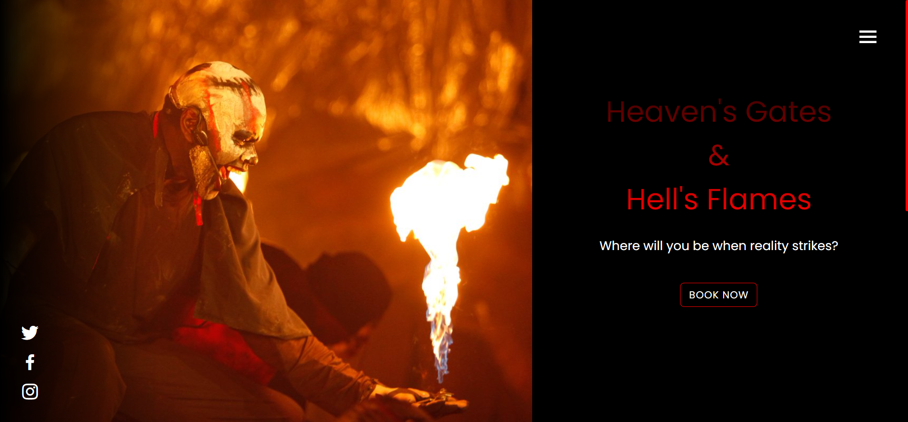

# [](https://githiomi.github.io/HGHF) Heaven's Gates and Hell's Flames

> Developed by <a href="http://github.com/githiomi">DANIEL GITHIOMI</a>

## DESCRIPTION

This is a contracted Job by Heaven's Gates and Hell's Flames to create a website for the ministry.

## PREVIEW



## SYSTEM REQUIREMENTS

* i5 Core or higher
* 4GB RAM or higher
* 16GB Internal storage or higher

## COMPATIBILITY

Compatible with all browsers including Safari and Internet Explorer making sure it is responsive.

## TECHNOLOGIES USED

This portfolio was made entirely using Visual Studio Code using the following technologies:

* HTML 5
* CSS
* Bootstrap
* Javascript

## KNOWN BUGS

No bugs to report at the moment! the system works efficiently at 100% guaranteed.

__Slow internet connection can result in faulty rendering of animations and images__

## LIVE PAGES

[Click-Here](https://githiomi.github.io/HGHF/) to view GitHub's live pages version of my portfolio.

## SETUP INSTRUCTIONS

* Git clone [this](https://www.github.com/githiomi/HGHF) into your terminal.  
* Open the folder in your favourite editor, for example vscode, using the following syntax:

``` (Javasript)
code .
```

* Ensure you have the live server installed on your version of Visual Studio Code.
* Open the website using the live server extension
* Get ministered to through the website

## SUPPORT AND CONTACT INFORMATION

Contact me through any of the following channels:

* Slack: danielgithiomi
* Email: <danielgithiomi@gmail.com>

## LICENSES

Click the following to access my license page: [Click-Here](https://githiomi.github.io/Privacy-Policy/)

> Copyright (c) {2024} DhosioLux.
